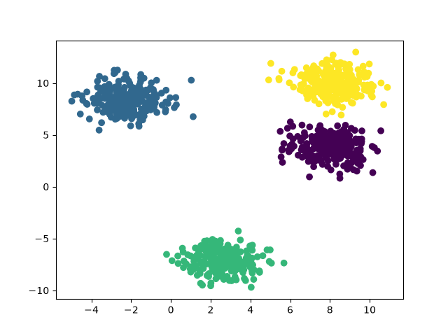
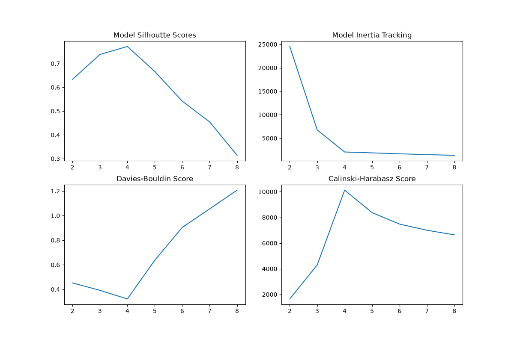
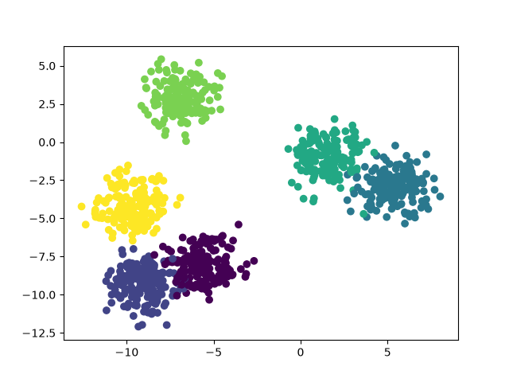
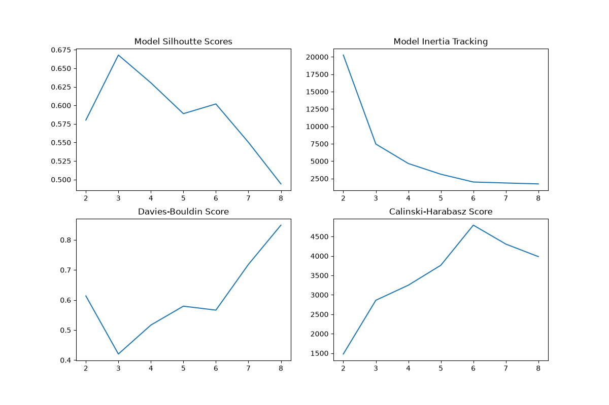

# K-Finder
An algorithm for finding optimal k values for clustering in unsupervised machine learning. It is an ensemble algorithm which makes four greedy choices based on four different unsupervised clusering metrics.
### Model Inertia Elbow:
The algorithm selects the k value corresponding with the elbow of the curve, the implementation of which I got the idea from the kneedle algorithm. It uses geometric distance to detect the point at which the elbow occurs.
### Silhouette Score:
A metric which shows how similar a point is to its own cluster compared to others, defined as:
$$
s(i) = \frac{b(i) - a(i)}{max(a(i), b(i))}
$$
where:
$$
a(i) = \text{Mean distance between point } i \text{and all other points}
$$
$$
b(i)= \text{The mean distance between point} i \text{and all points in the nearest neighboring cluster}
$$
### Davies-Bouldin Score
### Calinski-Harabasz Score

## Usage
Simply import the method into your codespace and use the method as directed in the docstring. The only constraint is that your data is expected to be as an array like of (n_samples, n_features). 

## Demonstration
Here is a synthetic dataset containing data with 4 centroids generated by `sklearn.datasets.make_blobs`. It contains 4 centroids, two of which are tightly packed.

All members of the ensemble voted for k=4 in this case:

On larger true k values data tends to become far more tightly packed which can result in multiple k values which are valid. This is seen in the following scatter in which there are 6 true centroids. 

From viewing the data it is clear that k=3 or even k=4 are valid options, but the true value is also in the returned set of valid ks, allowing the selection to be up to the discretion of the user who may want to try clustering with all valid ks.

